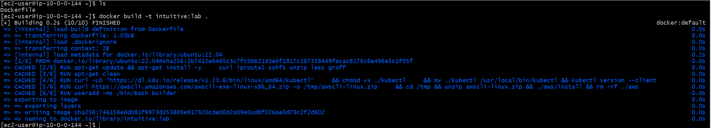
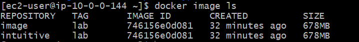
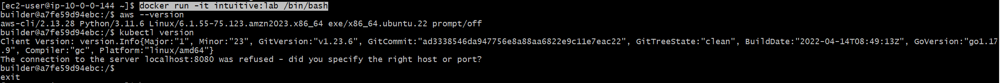

# Intuitive-Lab
Intuitive Lab - DevSecOps - Ranjith

Copy file to the path where you would like to build the image and run following command 
``` docker build -t intuitive:lab . ```


 
 To list all available images on host/node
``` docker image ls```


To run the container in interactive mode
``` docker run -it intuitive:lab /bin/bash ```


I'm able to check awscli and kubectl versions


### Push image to repository

``` docker login --username username ```
prompts for password if you omit --password which is recommended as it doesn't store it in your command history

``` docker tag my-image username/my-repo ```

``` docker push username/my-repo ```